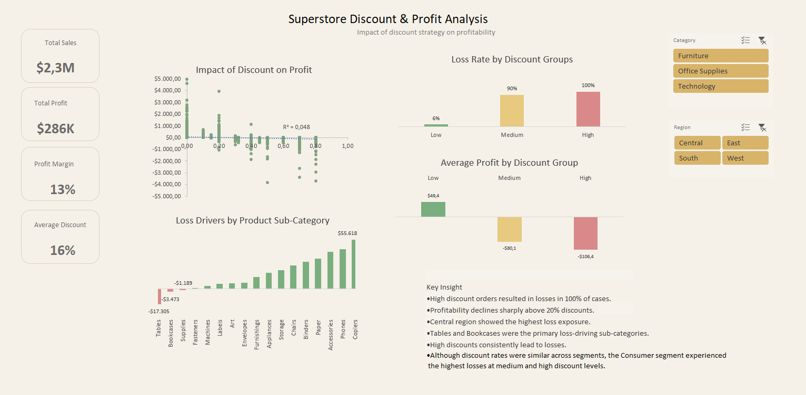

# Superstore Discount & Profit Analysis

## Project Overview

This project analyzes the relationship between discount strategies and profitability using the Superstore dataset.

The dashboard focuses on identifying how different discount levels impact profit, loss rates, product performance, customer segments, and regional profitability.

The goal of this analysis is to uncover key business risks caused by aggressive discounting and provide actionable insights for improving pricing and profitability.

---

## Tools Used

- Microsoft Excel
- Pivot Tables
- Pivot Charts
- Scatter Plot Analysis
- Slicers
- KPI Cards

---

## Data Analysis Techniques

- Correlation Analysis
- Profit Margin Analysis
- Loss Rate Analysis
- Category & Sub-Category Analysis
- Regional Analysis
- Customer Segment Analysis

---

## Key KPIs

- Total Sales
- Total Profit
- Profit Margin (%)
- Average Discount (%)

---

# Dashboard Features

## 1. Impact of Discount on Profit

A scatter plot was used to analyze the relationship between discount levels and profitability.

### Findings

- Higher discounts are associated with increased losses.
- The relationship between discount and profit is negative but relatively weak.
- R² value (~0.05) indicates that discount alone explains only a small portion of profit variation.

### Business Insight

Higher discount levels tend to reduce profitability and increase financial risk.

---

## 2. Loss Rate by Discount Group

Discounts were grouped into:

- Low
- Medium
- High

### Findings

- Low discounts resulted in only a 6% loss rate.
- Medium discounts resulted in a 90% loss rate.
- High discounts resulted in a 100% loss rate.

### Business Insight

High discounts consistently increase the likelihood of losses and negatively impact profitability.

---

## 3. Average Profit by Discount Group

Average profit was analyzed across discount groups.

### Findings

- Low discounts remained profitable.
- Medium and high discounts generated negative average profit.

### Business Insight

Aggressive discount strategies erode profit margins instead of generating sustainable profitability.

---

## 4. Loss Drivers by Sub-Category

Sub-category analysis was performed to identify the primary sources of losses.

### Findings

- Tables and Bookcases were consistently unprofitable.
- Copiers generated the highest profit.

### Business Insight

Certain product sub-categories remain unprofitable despite sales activity, indicating pricing or discount optimization opportunities.

---

## 5. Regional Profitability Analysis

Profit margin and loss exposure were analyzed across regions.

### Findings

- West region achieved the highest profit margin.
- Central region showed the weakest profitability and highest loss exposure.

### Business Insight

The negative impact of discounting appears consistently across regions, suggesting a broader pricing strategy issue rather than a regional problem.

---

## 6. Customer Segment Analysis

Customer segments were compared based on average discount and profitability.

### Findings

- Discount rates were relatively similar across all customer segments.
- Consumer segment showed the highest loss exposure under medium and high discount levels.

### Business Insight

Although discount percentages were similar, the Consumer segment carried the largest loss exposure due to higher transaction volume.

---

# Key Findings

- High discounts lead to consistent losses.
- Medium and high discount groups show extremely high loss rates.
- Tables and Bookcases are major loss drivers.
- Central region has the highest loss exposure.
- Consumer segment showed the highest losses under aggressive discounting.

---

# Conclusion

This analysis demonstrates that excessive discounting significantly reduces profitability.

While discounts may increase sales volume, aggressive discount strategies often fail to offset margin losses.

The findings suggest that optimizing discount policies, especially for specific sub-categories and regions, could improve overall business profitability.

---
## Dashboard Preview

---
